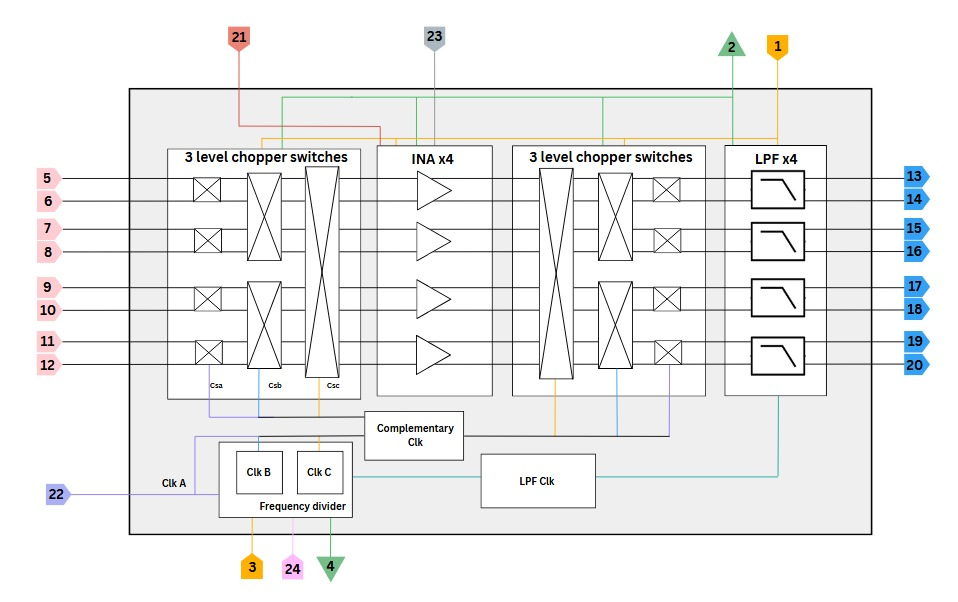

# A2: GenYZ Team - Low Mismatch 4 Channels EEG

[Pin List](https://docs.google.com/spreadsheets/d/1RcXbY3-Z_9W2Oks1J88uDMK3sVfhn4uYAb-6Ts39JXk/edit?gid=0#gid=0)

<h4 align="center" style="font-size:16px;">Figure 1. Chip Architecture</h4>

