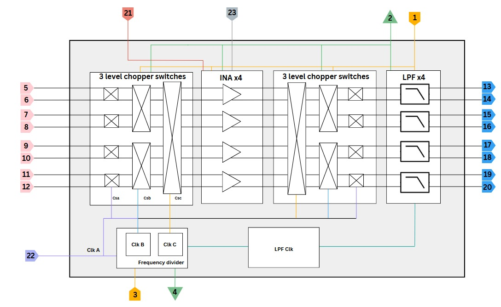

<h4 align="center" style="font-size:16px;">Figure 1. Chip Architecture</h4>

<h4 align="center" style="font-size:16px;">Table 1. Pin Out</h4>

<table>
  <thead>
    <tr>
      <th><b>Pin</b></th>
      <th><b>Name</b></th>
      <th><b>Type</b></th>
      <th><b>Direction</b></th>
      <th><b>Description</b></th>
    </tr>
  </thead>
  <tbody>
    <tr><td align="center">1</td><td>AVDD</td><td>3V Power</td><td>Bidirectional</td><td>Analog Supply Voltage</td></tr>
    <tr><td align="center">2</td><td>AVSS</td><td>Ground</td><td>Bidirectional</td><td>Analog Ground</td></tr>
    <tr><td align="center">3</td><td>VDD</td><td>5V Power</td><td>Bidirectional</td><td>Digital Supply Voltage</td></tr>
    <tr><td align="center">4</td><td>VSS</td><td>Ground</td><td>Bidirectional</td><td>Digital Ground</td></tr>
    <tr><td align="center">5</td><td>IN1P</td><td>Analog</td><td>Input</td><td>Channel 1 Analog Positive Input</td></tr>
    <tr><td align="center">6</td><td>IN1N</td><td>Analog</td><td>Input</td><td>Channel 1 Analog Negative Input</td></tr>
    <tr><td align="center">7</td><td>IN2P</td><td>Analog</td><td>Input</td><td>Channel 2 Analog Positive Input</td></tr>
    <tr><td align="center">8</td><td>IN2N</td><td>Analog</td><td>Input</td><td>Channel 2 Analog Negative Input</td></tr>
    <tr><td align="center">9</td><td>IN3P</td><td>Analog</td><td>Input</td><td>Channel 3 Analog Positive Input</td></tr>
    <tr><td align="center">10</td><td>IN3N</td><td>Analog</td><td>Input</td><td>Channel 3 Analog Negative Input</td></tr>
    <tr><td align="center">11</td><td>IN4P</td><td>Analog</td><td>Input</td><td>Channel 4 Analog Positive Input</td></tr>
    <tr><td align="center">12</td><td>IN4N</td><td>Analog</td><td>Input</td><td>Channel 4 Analog Negative Input</td></tr>
    <tr><td align="center">13</td><td>OUT1P</td><td>Analog</td><td>Output</td><td>Channel 1 Analog Positive Output</td></tr>
    <tr><td align="center">14</td><td>OUT1N</td><td>Analog</td><td>Output</td><td>Channel 1 Analog Negative Output</td></tr>
    <tr><td align="center">15</td><td>OUT2P</td><td>Analog</td><td>Output</td><td>Channel 2 Analog Positive Output</td></tr>
    <tr><td align="center">16</td><td>OUT2N</td><td>Analog</td><td>Output</td><td>Channel 2 Analog Negative Output</td></tr>
    <tr><td align="center">17</td><td>OUT3P</td><td>Analog</td><td>Output</td><td>Channel 3 Analog Positive Output</td></tr>
    <tr><td align="center">18</td><td>OUT3N</td><td>Analog</td><td>Output</td><td>Channel 3 Analog Negative Output</td></tr>
    <tr><td align="center">19</td><td>OUT4P</td><td>Analog</td><td>Output</td><td>Channel 4 Analog Positive Output</td></tr>
    <tr><td align="center">20</td><td>OUT4N</td><td>Analog</td><td>Output</td><td>Channel 4 Analog Negative Output</td></tr>
    <tr><td align="center">21</td><td>VBIAS</td><td>Analog</td><td>Bidirectional</td><td>Biasing Voltage for Analog and Digital Components</td></tr>
    <tr><td align="center">22</td><td>CLK</td><td>Digital</td><td>Input</td><td>Clock as Digital Controller for Chopper Switches, etc.</td></tr>
    <tr><td align="center">23</td><td>VCM</td><td>Analog</td><td>Bidirectional</td><td>Common Mode Voltage</td></tr>
  </tbody>
</table>

